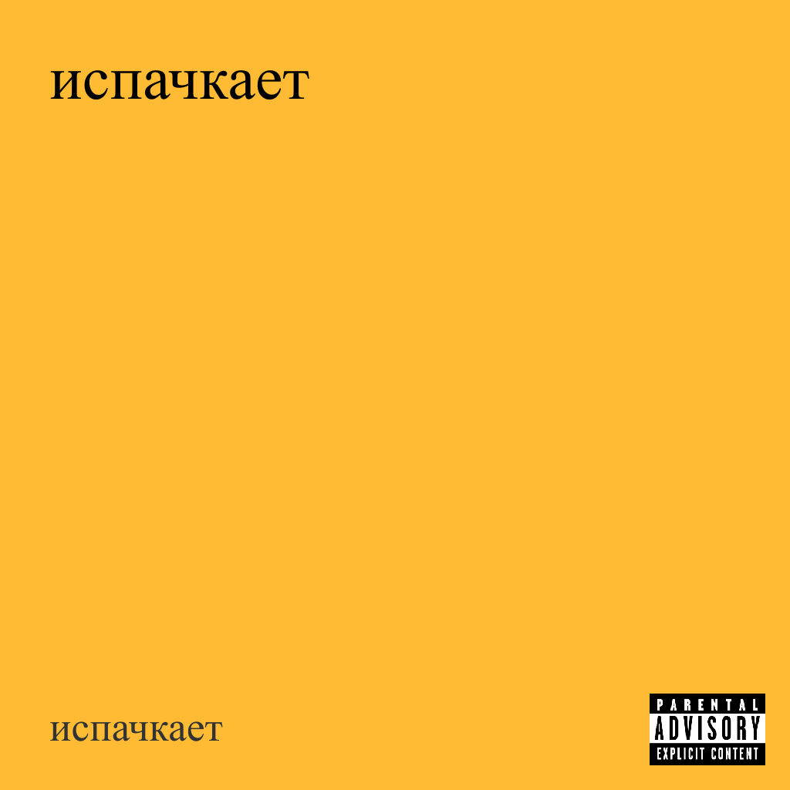
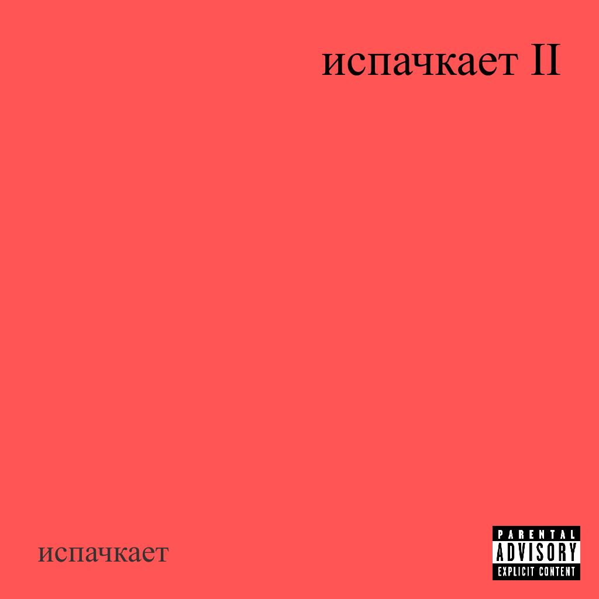
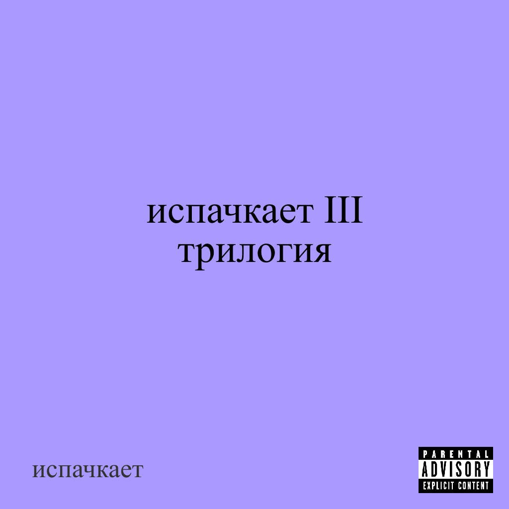

# испачкает

**"испачкает"** - российская музыкальная группа из Казани, созданная Даньком Испачканым. Играет в жанрах рок, русский шансон и данс макабр. Дебютный альбом "испачкает" был выпущен 6 июня 2025 года под лейблом Грязный Костик Records.





## Использование 

## Использование

### Запуск через Go

```bash
go run cmd/main.go
```

выходные изображения сохраняются в папке `output`

### Флаги

- `title` - устанавливает надпись альбома. Перевод на новую строку осуществляется через \n
- `author` - устанавливает надпись автора.
- `bg` - устанавливает цвет фона. Вводится в hex формате (ffffff).
- `output` - название выходного файла без расширения. Файлы всегда сохраняются в формате png.
- `alignment` - выравнивание текста. Возможные значения: left, right, center
